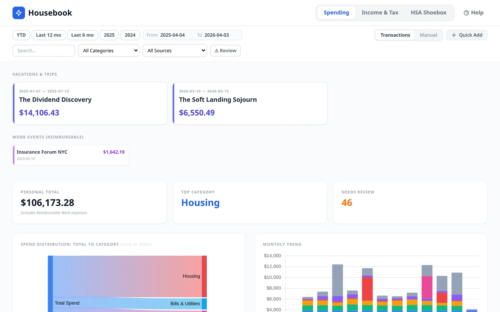
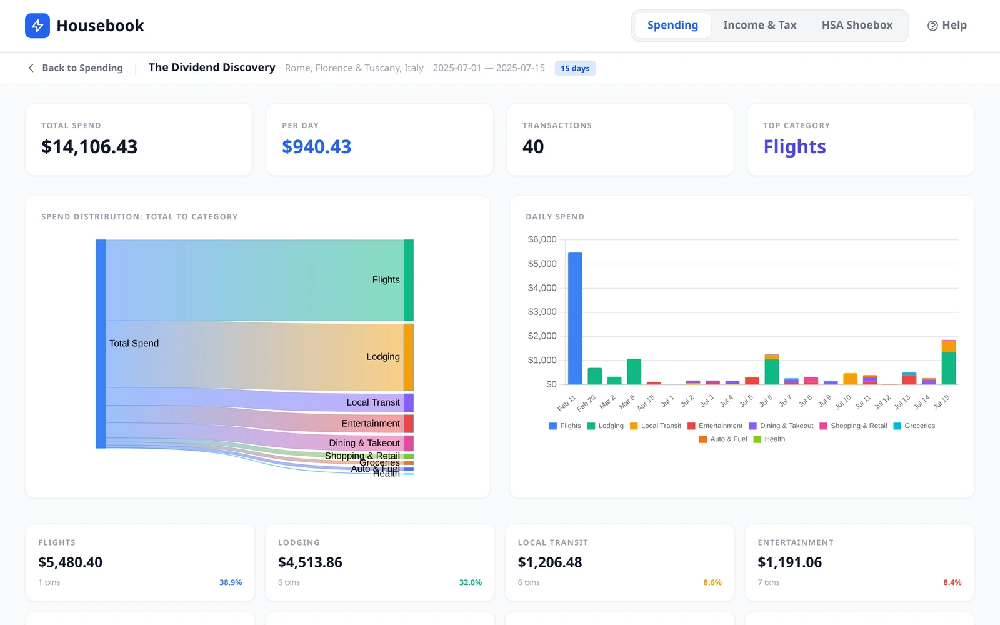
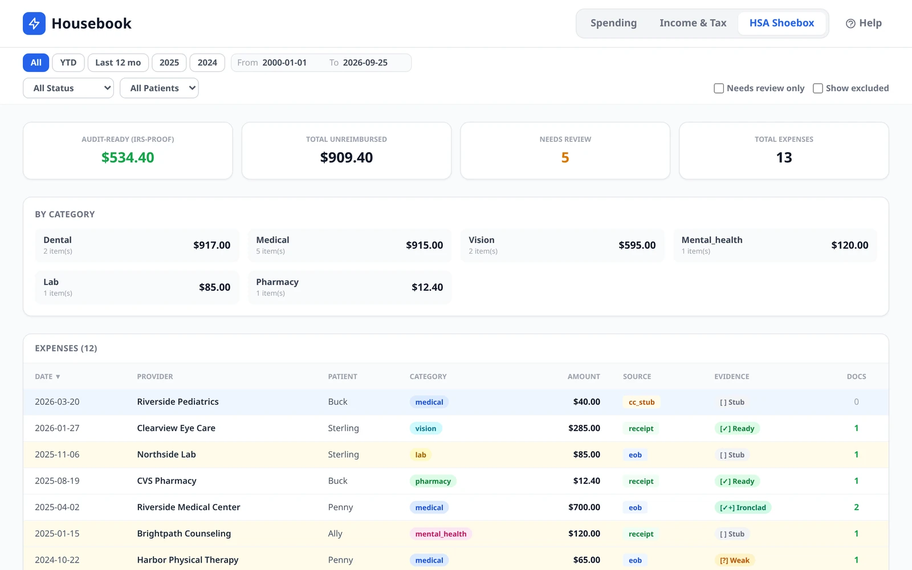
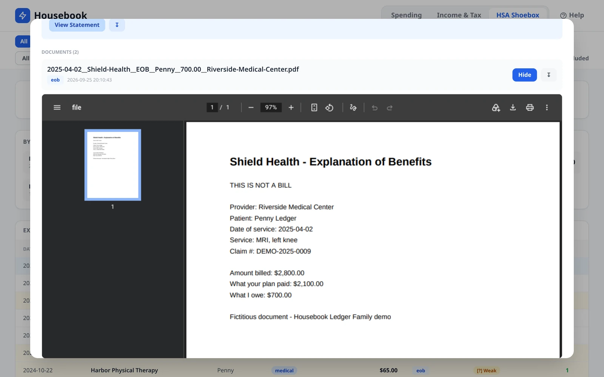
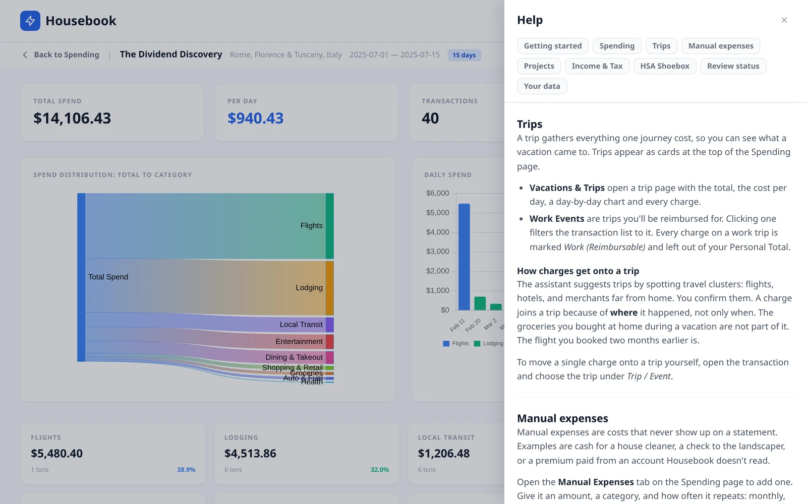

# Housebook

**Housebook turns your household's paperwork into a private ledger on
your own computer.** You hand it card statements, Amazon order exports,
tax forms and medical receipts. It gives you a dashboard of where the
money went, what each trip cost, and which medical bills you can still
reimburse from your HSA. The paperwork itself is done by an AI coding
agent, such as Claude Code or Gemini CLI, working in this repository.



## What it does

- **Spending.** Every charge from your cards, bank and Amazon, sorted
  into categories. Totals leave out what isn't really spending: card
  payments, and purchases you returned for a full refund.
- **Trips.** Groups everything one journey cost, including the flight
  you booked two months earlier, but not the groceries you bought at
  home while you were away.
- **HSA shoebox.** Keeps proof for every medical bill you paid out of
  pocket, so you can pay yourself back from your HSA tax-free, even
  years later. Each expense shows how strong its proof is.
- **Income & tax.** Collects each year's W-2s, 1099s and 1098s, and
  estimates your federal tax.
- **Projects and manual expenses.** Tracks a renovation against its
  budget, and records costs that never show up on a statement, like
  cash paid to a contractor.

Housebook is built around a US household's paperwork. The tax page
also handles Brazilian income for people who file in both countries.

<table>
  <tr>
    <td></td>
    <td></td>
  </tr>
  <tr>
    <td align="center">What a vacation really cost</td>
    <td align="center">Medical expenses and how well each is documented</td>
  </tr>
  <tr>
    <td></td>
    <td></td>
  </tr>
  <tr>
    <td align="center">The documents behind each medical expense</td>
    <td align="center">Built-in help for every page</td>
  </tr>
</table>

Every name and number in these screenshots is invented.

## How it works

You don't type transactions in, and Housebook never calls an AI
service itself. Instead, an AI coding agent is the operator:

1. **You hand the agent files.** For example: "import the statements in
   my Downloads folder".
2. **The agent files them.** It reads each document and works out what
   it is. It files the document in your workspace with a small
   structured summary beside it.
3. **Housebook imports them.** Plain, deterministic code reads the
   summaries into a local SQLite database. Every new row starts out
   *unverified*.
4. **The agent reviews them.** It follows the written procedures in
   `prompts/` to fix categories, spot trips and pair refunds with their
   purchases.
5. **You check the result in the dashboard.** You correct anything
   that's wrong, and your correction wins over any later guess.

So you need an AI coding agent you're comfortable using. Housebook
itself is the database, the import code, the procedures the agent
follows, and the dashboard.

## Try the demo

The demo is five years of an invented family's finances, so you can
look around without any data of your own:

```bash
git clone https://github.com/adereis/housebook.git
cd housebook
./bootstrap.sh                   # creates .venv and installs Housebook
.venv/bin/housebook-demo-seed    # writes demo-workspace/
HOUSEBOOK_WORKSPACE_DIR=demo-workspace .venv/bin/housebook-app
```

Then open <http://127.0.0.1:8000>. Try the Italy trip on the Spending
page, and click an expense in the HSA Shoebox to open its receipts. The
**Help** button in the header explains each page.
`demo-workspace/README.md` tells the family's story.

## Your data and privacy

- **The ledger stays on your computer.** It lives in a workspace folder
  that you choose, outside this repository. Housebook's code makes no
  AI calls. Its dashboard loads nothing from the internet, so it also
  works offline.
- **The agent is the exception.** To import and review your documents,
  the AI agent has to read them. Their contents therefore reach
  whichever AI provider runs that agent.
- **Sync is optional.** It backs the workspace up to a storage remote
  you configure, via rclone, and talks to nothing else.

## Set up with your own data

1. **Install the system tools:** `poppler-utils` (for `pdftotext`),
   `sqlite3`, and `direnv` (recommended).
2. **Choose a workspace:** create a folder **outside this repository**
   for your financial data. Copy `.env.example` to `.env` and set
   `HOUSEBOOK_WORKSPACE_DIR` to that folder. There is no default, so
   every command refuses to run until the workspace exists.
3. **Bootstrap:** run `./bootstrap.sh`. It creates the virtual
   environment and the database.
4. **Allow direnv, once:** run `direnv allow`. This puts the
   `housebook-*` commands on your PATH inside the repository.

## Day-to-day use

Most of the time you talk to the agent, and it runs the commands. These
are the ones you'll see:

```bash
housebook-ingest list --latest   # which statements are in, and any gaps
housebook-amazon import ~/Downloads/Amazon-Data-Export.zip --profile <name>
housebook-cc ingest              # after the agent has filed new card statements
housebook-audit pending          # what still needs review
housebook-app                    # the dashboard, at http://127.0.0.1:8000
```

The review step after every import is required, not optional. It is how
guessed categories become checked ones; see `prompts/monthly_audit.md`.

The dashboard only answers the computer it runs on. Reaching it from
other devices at home requires an authenticating proxy. That setup is
described in [`deploy/lan/README.md`](deploy/lan/README.md) and is not
yet a supported configuration.

## Contributing

`AGENTS.md` describes the architecture, the rules the code keeps, and
how each data source is handled. Run `./test.sh` before every commit.

## License

MIT. See [`LICENSE`](LICENSE). To report a vulnerability, see
[`SECURITY.md`](SECURITY.md).
